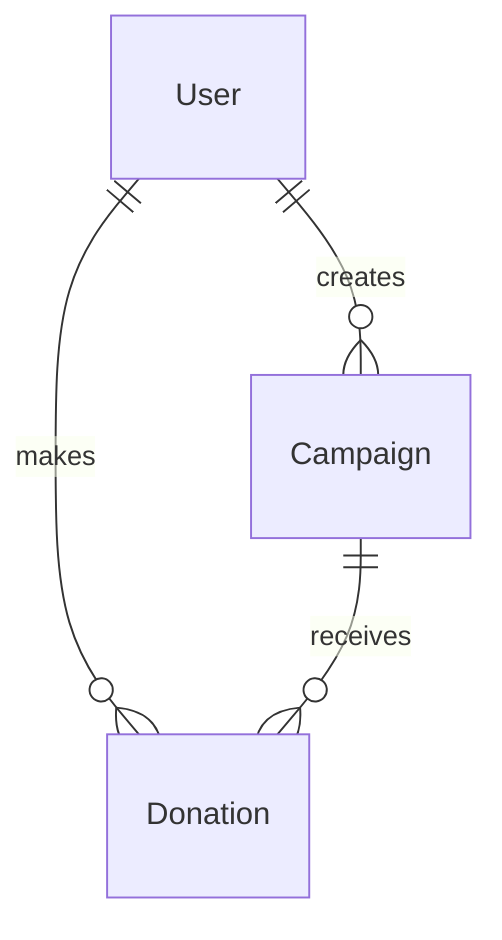

# CrowdFunding Backend API

This directory contains the Node.js and Express backend API for the CrowdFunding platform. It handles user authentication, campaign creation, donation logs, Stripe payment verification, transactional email triggers, and cron schedulers.

## Table of Contents

- [About the Backend](#about-the-backend)
- [Server Entry Flow](#server-entry-flow)
- [Environment Configurations](#environment-configurations)
- [Installation and Execution](#installation-and-execution)
- [Database Schemas](#database-schemas)
- [API Routes and Controllers Map](#api-routes-and-controllers-map)
- [Utility Scripts](#utility-scripts)

## About the Backend

The backend is built as a RESTful JSON API using **Express 5** and **Mongoose 9**. It establishes a secure connection to MongoDB and exposes endpoints for public data views, client interactions (campaign creation and donations), and administrative controls (campaign approvals and user state management).

## Server Entry Flow

The main entry point of the server is `server.js`. The initialization flow operates as follows:

1. **Configurations Loading**: Load system variables from the `.env` file using the `dotenv` parser.
2. **Middleware Pipeline**:
   - `helmet`: Enhances API security headers.
   - `cors`: Grants cross-origin request permissions to the specified client URL, allowing credentials to pass through.
   - `express.json()`: Parses incoming JSON payloads (with raw JSON body parsing active specifically for the `/api/user/webhook` Stripe endpoint).
   - `cookieParser()`: Reads request headers to extract secure JWT session keys.
   - `morgan`: Outputs HTTP request logs in development mode.
3. **Database Connection**: Invokes Mongoose to open a connection pool to MongoDB.
4. **Routes Mounting**: Maps endpoints to the respective routing routers:
   - `/api/common` -> `commonApp.js`
   - `/api/user` -> `userApi.js`
   - `/api/admin` -> `AdminApi.js`
5. **Scheduler Engine**: Activates `scheduler.js` to begin background processing cron tasks.
6. **Error handling**: Intercepts unhandled routing calls or system errors inside a global Express error-handler middleware.

## Environment Configurations

You must create a `.env` file in the root of this directory with the following variables:

| Variable | Description | Example / Required Value |
| :--- | :--- | :--- |
| `PORT` | The port the Express server will listen on. | `3000` |
| `DB_URL` | Connection URI string to the MongoDB instance. | `mongodb://localhost:27017/crowdfunding` |
| `JWT_SECRET` | Secret token used to sign and verify JSON Web Tokens. | `super_secure_random_string` |
| `STRIPE_SECRET_KEY` | Private API key obtained from the Stripe developer dashboard. | `sk_test_...` |
| `STRIPE_WEBHOOK_SECRET`| Signing secret used to verify Stripe webhook signatures. | `whsec_...` |
| `EMAIL_HOST` | Outbound mail transfer agent host. | `smtp.gmail.com` |
| `EMAIL_PORT` | Port used to connect to the mail server. | `587` |
| `EMAIL_USER` | Email username used to send transactional updates. | `user@example.com` |
| `EMAIL_PASS` | Password or App password for email client verification. | `app_password` |
| `EMAIL_FROM` | Sender address to display in outbound emails. | `noreply@crowdfunding.com` |
| `CLIENT_URL` | The client-side origin URL to whitelist for CORS access. | `http://localhost:5173` |

## Installation and Execution

1. Change directory to backend:
   ```bash
   cd backend
   ```

2. Install dependencies:
   ```bash
   npm install
   ```

3. Launch development server with live reload (uses `nodemon`):
   ```bash
   npm run dev
   ```

4. Launch production server:
   ```bash
   npm start
   ```

---

## Database Schemas

The database consists of three primary collections: `users`, `campaigns`, and `donations`. Their schemas and references are detailed below.

### 1. User Schema

The `User` schema manages user accounts, roles, and references to campaigns they created or donations they made.

| Field Name | Type | Required / Options | Default | Description |
| :--- | :--- | :--- | :--- | :--- |
| `firstName` | `String` | Required, minLength: 2 | - | The first name of the user. |
| `lastName` | `String` | Optional | - | The last name of the user. |
| `email` | `String` | Required, Unique | - | The user's email address used for login. |
| `password` | `String` | Required | - | Hashed password. |
| `campaigns` | `[ObjectId]` | Array of `Campaign` refs | `[]` | Campaigns created by the user. |
| `donations` | `[ObjectId]` | Array of `Donation` refs | `[]` | Donations made by the user. |
| `isActive` | `Boolean` | Optional | `true` | Status indicating if the user account is active. |
| `role` | `String` | Enum: `["USER", "ADMIN"]` | `"USER"` | User classification on the platform. |
| `createdAt` | `Date` | Generated by timestamps | - | Timestamp when the user was created. |
| `updatedAt` | `Date` | Generated by timestamps | - | Timestamp when the user was last updated. |

---

### 2. Campaign Schema

The `Campaign` schema stores information about individual crowdfunding initiatives launched by users.

| Field Name | Type | Required / Options | Default | Description |
| :--- | :--- | :--- | :--- | :--- |
| `title` | `String` | Required, minLength: 5, Trimmed | - | The title of the crowdfunding campaign. |
| `description` | `String` | Required | - | Detailed description of the campaign's purpose. |
| `goalAmount` | `Number` | Required | - | The target funding amount. |
| `raisedAmount`| `Number` | Optional | `0` | The cumulative amount donated so far. |
| `deadline` | `Date` | Required | - | Date by which the target amount needs to be raised. |
| `creator` | `ObjectId` | Required, Ref to `User` | - | The user who created the campaign. |
| `donations` | `[ObjectId]` | Array of `Donation` refs | `[]` | Donations linked to this campaign. |
| `status` | `Boolean` | Optional | `false` | Status of the campaign (e.g. approved/active or pending/completed). |
| `imageUrl` | `String` | Optional | `""` | Banner image URL for the campaign. |
| `createdAt` | `Date` | Generated by timestamps | - | Timestamp when the campaign was created. |
| `updatedAt` | `Date` | Generated by timestamps | - | Timestamp when the campaign was last updated. |

---

### 3. Donation Schema

The `Donation` schema tracks contributions made by users towards specific campaigns.

| Field Name | Type | Required / Options | Default | Description |
| :--- | :--- | :--- | :--- | :--- |
| `donor` | `ObjectId` | Required, Ref to `User` | - | The user who made the donation. |
| `campaign` | `ObjectId` | Required, Ref to `Campaign` | - | The campaign being funded. |
| `amount` | `Number` | Required, min: 1 | - | The donation amount. |
| `paymentStatus`| `String` | Enum: `["pending", "success", "failed"]` | `"pending"` | The status of the payment transaction. |
| `transactionId`| `String` | Required, Unique | - | Unique transaction identifier generated by the payment gateway. |
| `description` | `String` | Trimmed, maxLength: 200 | - | Optional short message from the donor. |
| `createdAt` | `Date` | Generated by timestamps | - | Timestamp when the donation was made. |
| `updatedAt` | `Date` | Generated by timestamps | - | Timestamp when the donation record was last updated. |

---

### Relationships & Architecture



*   **One-to-Many Relationships**:
    *   A `User` can create multiple `Campaigns`.
    *   A `User` can make multiple `Donations`.
    *   A `Campaign` can receive multiple `Donations`.
*   **Database Referencing**:
    *   References are stored using MongoDB `ObjectId`s.
    *   `campaigns` and `donations` arrays are maintained on the `User` document for swift lookup of user-centric activities.
    *   `donations` array is maintained on the `Campaign` document to retrieve campaign history easily.

---

## API Routes and Controllers Map

Detailed documentations for sub-packages can be accessed below:

- **[Models](models/)**: Mongoose collection schemas.
- **[Routes](routes/)**: Express routing paths and roles constraints.
- **[Controllers](controllers/)**: Controllers handling Stripe integrations and transactional operations.
- **[Middleware](middleware/)**: Custom JWT verification systems.
- **[Services](services/)**: Email pipelines, auth services, and scheduling engines.

## Utility Scripts

The backend folder features helper utility scripts:

- **`inspectDB.js`**: Connects to the database and prints collection counts and data statistics. Run using: `node inspectDB.js`.
- **`seedAdmin.js`**: Seeds a default administrator user account if it doesn't already exist. Run using: `node seedAdmin.js`.
- **`updateCampaignImages.js`**: Quick script to update placeholder image URLs on existing campaigns. Run using: `node updateCampaignImages.js`.
- **`test.http`**: A collection of HTTP request templates for testing API endpoints using REST client tools.
