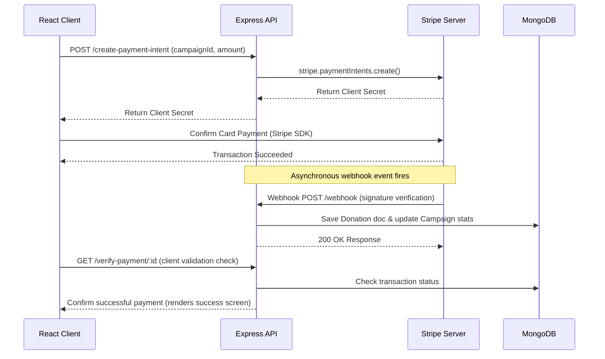

# Backend Controllers

This directory contains the controllers responsible for executing the core business logic of the CrowdFunding application, particularly the Stripe payment processing pipeline.

## Table of Contents

- [About the Directory](#about-the-directory)
- [Stripe Payment Controller](#stripe-payment-controller)
- [Workflow and Sequence Flows](#workflow-and-sequence-flows)
- [Integrations](#integrations)

## About the Directory

Controllers contain the execution code triggered by routing endpoints. They parse incoming requests, perform business validations, query/update database models, interface with third-party service APIs, and formulate JSON payloads returned to client apps.

## Stripe Payment Controller

The backend contains `paymentController.js`, which interfaces with the Stripe API to handle donations. It exposes three primary functions:

### 1. `createPaymentIntent`
- **Purpose**: Initializes a new Stripe transaction.
- **Processing**:
  - Validates that the donation amount is at least 1 unit.
  - Converts the amount to subunits (Stripe expects amounts in paisa for INR).
  - Registers metadata on Stripe including `campaignId`, `donorId`, and optional donor description.
  - Returns a unique `clientSecret` used by the React frontend to mount the Stripe Card input form.

### 2. `handleWebhook`
- **Purpose**: Direct endpoint to intercept webhook event payloads sent by Stripe servers.
- **Security**: Verifies payload signature integrity (`stripe-signature`) using the `STRIPE_WEBHOOK_SECRET`.
- **Handling Events**:
  - `payment_intent.succeeded`: Marks transaction status as `"success"`, increments `raisedAmount` on the target campaign, updates donation arrays on the campaign and donor schemas, and initiates automated email notifications.
  - `payment_intent.payment_failed`: Log failures and sets transaction status to `"failed"`.
- **Idempotency**: Prevents duplicate calculations by verifying if a transaction has already been successfully processed.

### 3. `verifyPaymentStatus`
- **Purpose**: Fallback polling endpoint for client verification (self-healing mechanism).
- **Processing**:
  - Resolves cases where webhook deliveries are delayed or blocked.
  - Directly queries the Stripe API using `paymentIntentId`.
  - Performs the same model updates and email events as the webhook upon success, ensuring identical processing paths.

## Workflow and Sequence Flows

The donation transaction sequence follows this lifecycle:

## Integrations

- **Stripe SDK**: Handles secure card charge flows.
- **Email Service**: Integrates with `emailService.js` to dispatch automated SMTP email receipts to donors and alert campaign creators of new contributions.
