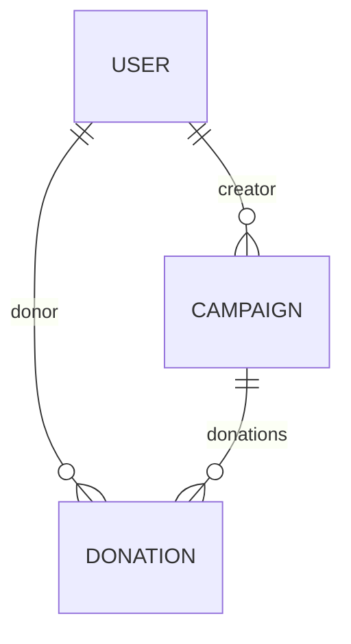

# Database Models

This directory defines the Mongoose schemas and models that govern the database structure of the CrowdFunding application.

## Table of Contents

- [About the Directory](#about-the-directory)
- [Entity-Relationship Diagram](#entity-relationship-diagram)
- [Model Schemas](#model-schemas)
  - [User Model](#user-model)
  - [Campaign Model](#campaign-model)
  - [Donation Model](#donation-model)

## About the Directory

The application uses **MongoDB** as its database and **Mongoose** as an Object Data Modeling (ODM) library to enforce structured data types, default values, validations, and reference paths between entities.

## Entity-Relationship Diagram

The relationships between MongoDB collections are mapped below via Mongoose `ObjectId` references:

---

## Model Schemas

### User Model

Stored in the `users` collection. It manages registration details, roles, and historical links.

| Field | Type | Required | Unique | Validation / Defaults |
| :--- | :--- | :--- | :--- | :--- |
| `firstName` | `String` | Yes | No | Min length: 2 characters. |
| `lastName` | `String` | No | No | Optional. |
| `email` | `String` | Yes | Yes | Unique lookup address. |
| `password` | `String` | Yes | No | Bcrypt hashed string. |
| `campaigns` | `[ObjectId]` | No | No | Ref: `"Campaign"` array. |
| `donations` | `[ObjectId]` | No | No | Ref: `"Donation"` array. |
| `isActive` | `Boolean` | No | No | Default: `true`. |
| `role` | `String` | No | No | Enum: `["USER", "ADMIN"]`. Default: `"USER"`. |
| `createdAt` / `updatedAt` | `Date` | Generated | No | Managed via schema timestamps. |

### Campaign Model

Stored in the `campaigns` collection. Represents a fundraising project.

| Field | Type | Required | Unique | Validation / Defaults |
| :--- | :--- | :--- | :--- | :--- |
| `title` | `String` | Yes | No | Min length: 5 characters. Trimmed. |
| `description` | `String` | Yes | No | Long-text details. |
| `goalAmount` | `Number` | Yes | No | Funding target value. |
| `raisedAmount` | `Number` | No | No | Default: `0`. |
| `deadline` | `Date` | Yes | No | Expiration timestamp. |
| `creator` | `ObjectId` | Yes | No | Ref: `"User"` model owner. |
| `donations` | `[ObjectId]` | No | No | Ref: `"Donation"` collection links. |
| `status` | `Boolean` | No | No | Default: `false` (pending admin approval). |
| `imageUrl` | `String` | No | No | Default: `""` (campaign graphics URL). |
| `createdAt` / `updatedAt` | `Date` | Generated | No | Managed via schema timestamps. |

### Donation Model

Stored in the `donations` collection. Tracks payment transactions.

| Field | Type | Required | Unique | Validation / Defaults |
| :--- | :--- | :--- | :--- | :--- |
| `donor` | `ObjectId` | Yes | No | Ref: `"User"` contributor. |
| `campaign` | `ObjectId` | Yes | No | Ref: `"Campaign"` recipient. |
| `amount` | `Number` | Yes | No | Min: `1`. |
| `paymentStatus` | `String` | No | No | Enum: `["pending", "success", "failed"]`. Default: `"pending"`. |
| `transactionId` | `String` | Yes | Yes | Stripe Payment Intent ID. |
| `description` | `String` | No | No | Max length: 200 characters. Trimmed. |
| `createdAt` / `updatedAt` | `Date` | Generated | No | Managed via schema timestamps. |
